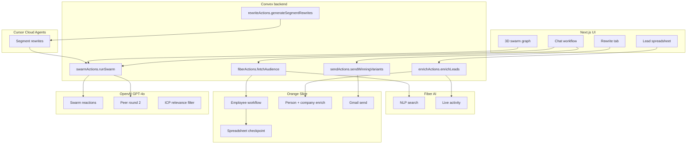

# Wingman

**Test before you fly.**

Wingman is a GTM simulation product: you describe your ICP in plain English, pull **real** decision-makers, enrich them with live signals, run your cold email through a **digital twin swarm** of those exact profiles, watch objections cluster by segment on a live 3D graph, **rewrite** per segment with Cursor, re-test, and **send** the winning variant — all in one loop.

Most outbound tools optimize *sending*. Wingman optimizes *knowing whether the message will work* before a single email leaves your inbox.

---

## Why Wingman wins (judge summary)

| What judges look for | What Wingman does |
|----------------------|-------------------|
| **Real data, not mocks** | Fiber NLP search + Orange Slice LinkedIn B2B pull — your ICP resolves to named humans with LinkedIn URLs |
| **Sponsor APIs load-bearing** | Every step of the loop calls a sponsor integration; remove any one and the product breaks |
| **Unique composition** | No one else chains *search → dual enrich → multi-round swarm → segment rewrite → re-swarm → send* in one UI |
| **Live, not batch** | Convex subscriptions stream leads, enrichments, and swarm reactions as they land |
| **Production-shaped** | Checkpointed Orange Slice workflows, Convex actions for secrets, segment-scoped rewrites, opt-in send |

---

## The full loop (8 steps)

```
ICP in chat
    │
    ▼
① Hybrid audience search ── Fiber NLP + Orange Slice workflow (parallel)
    │
    ▼
② Dual enrichment ── Fiber live LinkedIn activity + Orange Slice pain/funding
    │
    ▼
③ Draft message ── user pastes cold email in chat
    │
    ▼
④ Swarm round 1 ── OpenAI GPT-4o: each lead reacts in character, cites real signals
    │
    ▼
⑤ Swarm round 2 ── peer influence: personas see how others reacted, update sentiment
    │
    ▼
⑥ Segment score card ── predicted reply rate + top objections per segment (not one aggregate score)
    │
    ▼
⑦ Cursor SDK rewrite ── one variant per segment, fed swarm objections; swarm re-runs
    │
    ▼
⑧ One-click send ── Orange Slice Gmail integration fires the winning variant
```

---

## Stack deep dive — every sponsor, every feature, why it matters

### Fiber AI — *“Who is actually in market?”*

**Role in Wingman:** Fiber is the **natural-language audience discovery layer**. When you type *“CEO and CTO of humanoid robot labs”*, Fiber’s NLP search (`POST /v1/nlp-search/run`) returns real people with LinkedIn URLs, roles, and company context — not synthetic personas.

**Features we use:**

| Fiber API | Where | Why |
|-----------|-------|-----|
| **NLP Search** (`/v1/nlp-search/run`) | `lib/fiber.ts` → hybrid search in `lib/orangeSliceLeads.ts` | Plain-English ICP → structured people results; runs **in parallel** with Orange Slice pull |
| **Live activity fetch** (`profileLatestActivitiesLiveFetch`, `profilePostsLiveFetch`) | `lib/fiber.ts` → `lib/enrichLead.ts` | **Live signal** column: latest LinkedIn post or activity, with kind (post / comment / reaction) |
| **Kitchen-sink lookup** (`/v1/kitchen-sink/person`) | `lib/fiber.ts` | Deterministic person resolution for locked demo personas |

**How we use it uniquely:**

- **Hybrid search, not Fiber-only.** Fiber NLP runs in parallel with Orange Slice’s company-employee workflow. Results are merged, deduped, and filtered by role (CEO/CTO/founder gate) + company match + OpenAI relevance scoring. Fiber catches semantic ICP fit; Orange Slice catches verified LinkedIn employment data.
- **Fiber for signals, not for sending.** We deliberately split responsibilities: Fiber owns *live LinkedIn activity*; Orange Slice owns *firmographic pain + send*. Judges see both logos doing real work in different columns of the same spreadsheet.
- **Activity grounds the swarm.** Swarm agents cite `fiberSignal` and `painSignal` when reacting — objections are tied to real profile data, not hallucinated personas.

**Why we’re better than “just use Fiber search”:** Fiber alone returns broad NLP matches. Wingman cross-validates with Orange Slice employee DB, executive role filters, and AI relevance gates — so the spreadsheet shows *your* ICP, not keyword noise.

---

### Orange Slice — *“Engineered revenue workflows, not duct tape”*

**Role in Wingman:** Orange Slice is the **workflow engine** for audience pull, persona enrichment, live run logging, and outbound send. We embed their [Salesforce-style pattern](https://www.orangeslice.ai): pull → enrich in loop → checkpoint → downstream action.

**Features we use:**

| Orange Slice API | Where | Why |
|------------------|-------|-----|
| **`services.company.getEmployeesFromLinkedin`** | `lib/orangeSliceWorkflow.ts` | Pull CEOs/CTOs/founders at target companies (database + web strategy) |
| **`services.company.linkedin.findUrl` + `enrich`** | workflow + `lib/orangeslice.ts` | Resolve company slugs, logos, funding context |
| **`services.person.linkedin.enrich`** | enrichment pipeline | Extended profile: title, headline, company, locality |
| **`services.ai.generateObject`** | enrichment + ICP company planning | Pain signal, intent score, funding stage from real context blocks |
| **`services.web.batchSearch`** | `lib/orangeslice.ts` | Recent LinkedIn activity via site: dorks when Fiber is unavailable |
| **`ctx.createSpreadsheet` + `sheet.addRows`** | `lib/orangeSliceWorkflow.ts` | **Live run log** — every pull checkpointed in an Orange Slice spreadsheet (inspectable, rerunnable) |
| **`integrations.gmail.sendEmail`** | `lib/orangeslice.ts` → `convex/sendActions.ts` | One-click send through connected Gmail |
| **`POST /execute/email`** (managed sender) | fallback send path | Demo-safe delivery when Gmail isn’t connected |

**How we use it uniquely:**

- **Workflow, not wrapper.** `workflows/wingman-audience.workflow.ts` and `lib/orangeSliceWorkflow.ts` mirror Orange Slice’s documented engineered-workflow shape: spreadsheet as source of truth, per-lead status (`Pulled` → `Done` / `Error`), failures don’t kill the run.
- **Spreadsheet as observability.** Every search creates an Orange Slice spreadsheet ID stored on the Convex `audienceRuns` row — judges can open the live run in Orange Slice UI while Wingman streams rows.
- **Dual enrich with Fiber.** Orange Slice `enrichPersona` produces **pain signal**, **funding stage**, and **intent score** from LinkedIn + company extended data + `generateObject`. Fiber adds **live signal**. Both write to the same lead row in Convex.
- **Send closes the loop.** After swarm + rewrite + re-test, `sendWinningVariants` sends segment-specific copy via Orange Slice — the same platform that sourced the audience delivers the message.

**Why we’re better than “just use Orange Slice search”:** Orange Slice excels at checkpointed B2B workflows; Wingman adds Fiber semantic discovery, a multi-round reasoning swarm, segment-level rewrite, and a reactive UI — turning a data pipeline into a *GTM decision system*.

---

### OpenAI (GPT-4o) — *“Digital twins that actually think”*

**Role in Wingman:** OpenAI powers every **reasoning** step that requires judgment: swarm reactions, peer influence, ICP relevance filtering, and rewrite fallback.

**Features we use:**

| OpenAI capability | Where | Why |
|-------------------|-------|-----|
| **Structured outputs** (`response_format: json_schema`, strict) | `lib/openai.ts` | Every swarm reaction returns `{ sentiment, reasoningText, citedSignal }` — no free-text parsing |
| **GPT-4o chat completions** | swarm, peer round, ICP filter, rewrite fallback | Persona agents react *in character* using enriched lead fields |
| **ICP attachment parsing** | `lib/icpAttachment.ts` | Upload a PDF/doc → Fiber-ready ICP string |
| **Relevance gate** | `lib/icpLeadFilter.ts` | Post-search filter: keep only leads that match ICP (`yes` / `likely` for strict verticals) |

**How we use it uniquely:**

- **Two-round swarm with peer influence.** Round 1: each lead reacts solo. Round 2 (`convex/swarmRound2.ts`): each persona sees anonymized peer summaries and updates sentiment — modeling how objections spread in a buying committee. This is custom orchestration, not a single bulk prompt.
- **Reactions cite real signals.** Prompts require agents to quote `painSignal`, `fiberSignal`, or `recentActivity` — so the 3D graph shows *why* someone objected, not just that they did.
- **Segment-aware scoring.** `lib/scoreCard.ts` aggregates reactions into **scaled / early_stage / vertical_specialist** buckets with per-segment predicted reply rate and objection lists — those objections feed Cursor rewrites.

**Why we’re better than “ask ChatGPT if my email is good”:** One aggregate opinion is useless for GTM. Wingman runs N parallel persona agents on N real profiles, clusters by segment, and surfaces *which* line lost the CFO vs. the founder.

---

### Cursor SDK — *“Fix the email where it broke”*

**Role in Wingman:** After the swarm surfaces segment-level objections, **Cursor Cloud Agents** (Composer 2.5) rewrite the draft **once per segment** — not one generic polish pass.

**Features we use:**

| Cursor surface | Where | Why |
|----------------|-------|-----|
| **Cloud Agents REST API** (`POST /v1/agents`, model `composer-2.5`) | `lib/cursorCloudRest.ts` → `lib/cursorRewriteConvex.ts` | Runs inside Convex `"use node"` actions (SDK bundles locally; REST is the production path) |
| **`@cursor/sdk`** (`Agent.create`, cloud runtime) | `lib/cursorSdk.ts`, `scripts/test-cursor-sdk.mts` | Local dev + verification against same backend |
| **Segment-conditioned prompts** | `lib/cursorRewriteShared.ts` | Each rewrite gets swarm objections, dominant sentiment, and segment copy guidance |

**How we use it uniquely:**

- **Objection-driven, segment-specific rewrites.** `convex/rewriteActions.ts` calls `generateSegmentRewrites` with the top cited signals and full objection text from the score card — Cursor rewrites *early_stage* differently from *scaled*.
- **Subtle copy, not “I get why you’re skeptical.”** Prompts ban performative empathy openings; rewrites weave swarm themes into proof and specificity (see `lib/cursorRewriteShared.ts`).
- **Rewrite → re-swarm closed loop.** `retestRewrittenVariants` re-runs the swarm on segment rewrites so the score card shows **before/after** predicted reply rate movement.
- **OpenAI fallback with diff check.** If Cursor times out, GPT-4o rewrites with the same objection context; `rewriteDiffersEnough` rejects synonym-swap non-rewrites.

**Why we’re better than “paste into Cursor manually”:** Rewrites are **automatic**, **segment-scoped**, **grounded in swarm output**, and **re-tested in product** — embedded in the pipeline, not a separate IDE session.

---

### Convex — *“Everything live, nothing stale”*

**Role in Wingman:** Convex is the **reactive nervous system**. The UI never polls; it subscribes. When a lead inserts, an enrichment completes, or a swarm agent finishes, the graph and spreadsheet update immediately.

**Features we use:**

| Convex feature | Where | Why |
|----------------|-------|-----|
| **Queries + subscriptions** | `convex/leads.ts`, `convex/agentReactions.ts`, frontend `useQuery` | Spreadsheet, swarm graph, score card stay in sync |
| **`"use node"` actions** | `fiberActions`, `enrichActions`, `swarmActions`, `rewriteActions`, `sendActions` | Server-side calls to Fiber, Orange Slice, OpenAI, Cursor with secrets in env |
| **Internal mutations** | `insertLead`, `applyLeadEnrichment`, `insertInternal` (reactions) | Actions write incrementally; UI streams partial results |
| **Schema + indexes** | `convex/schema.ts` | `audienceRuns`, `leads`, `agent_reactions`, `segment_rewrites`, `sent_log` |
| **Env-isolated secrets** | `npx convex env set …` | API keys never touch the client or git |

**How we use it uniquely:**

- **Streaming search UX.** Leads appear in the spreadsheet as `onLead` callbacks fire from the hybrid search — users work while the run finishes.
- **Swarm reactions as live graph fuel.** Each `agent_reactions` insert triggers graph re-layout; sentiment color-codes nodes as reactions arrive.
- **Durable rewrite + send state.** Segment rewrites persist in `segment_rewrites`; send log in `sent_log` — full audit trail for demo and production.

**Why we’re better than a Next.js API route monolith:** Convex gives optimistic real-time UI for free, separates long-running actions from fast queries, and keeps sponsor keys server-side by default.

---

## Architecture



---

## What makes Wingman different (competitive framing)

1. **Real audience, not synthetic panels.** Fiber + Orange Slice resolve to named executives with LinkedIn URLs. The swarm runs on *those* profiles.

2. **Segment-level verdicts, not one score.** A single “70% good” is meaningless when CFOs object to pricing and founders want social proof. Wingman shows three segment cards and rewrites three ways.

3. **Closed loop: test → fix → re-test → send.** Cursor rewrites aren’t a copy-paste side quest; they’re triggered by swarm output, stored per segment, re-simulated, and sent via Orange Slice.

4. **Sponsor-native workflow design.** Orange Slice isn’t a search wrapper — it’s checkpointed spreadsheets + employee pull + enrich + Gmail send, exactly how Orange Slice documents engineered revenue ops.

5. **Live product, not a batch report.** Convex subscriptions mean the demo *feels* like infrastructure: rows appear, nodes glow, objections cluster while you watch.

---

## Sponsor track mapping

| Track | Wingman proof point |
|-------|---------------------|
| **Fiber AI** | NLP ICP search + live LinkedIn activity enrichment; hybrid merge with Orange Slice |
| **Orange Slice** | Full workflow (spreadsheet, getEmployeesFromLinkedin, enrich, generateObject, Gmail send) |
| **OpenAI** | Multi-round structured swarm + peer influence + ICP filtering |
| **Cursor** | Cloud Agent segment rewrites grounded in swarm objections, with re-test loop |
| **Convex** | Real-time backend for search, enrich, swarm, rewrite, and send state |

---

## Setup

```bash
git clone https://github.com/kavyakavime/wingman.git
cd wingman
npm install
cp .env.example .env.local

npx convex dev          # Convex dev server + function sync
npm run dev             # Next.js → http://localhost:3000
```

Set **all sponsor keys** in Convex (never in client code):

```bash
npx convex env set FIBER_API_KEY your_key
npx convex env set ORANGESLICE_API_KEY your_key
npx convex env set OPENAI_API_KEY your_key
npx convex env set CURSOR_API_KEY your_key
```

Optional: connect Gmail for live send (`npm run connect:gmail`).

See [SECURITY.md](./SECURITY.md) for the full secret-management pattern.

---

## Project structure

```
app/                    Next.js App Router
components/
  workspace/            Chat, spreadsheet, swarm graph, rewrite tab
convex/
  fiberActions.ts       Hybrid audience search action
  enrichActions.ts      Fiber + Orange Slice dual enrich
  swarmActions.ts       OpenAI swarm (round 1 + peer round 2)
  rewriteActions.ts     Cursor segment rewrites + re-test
  sendActions.ts        Orange Slice outbound send
  leads.ts              Runs, leads, enrichment mutations
  schema.ts             Typed tables + indexes
lib/
  fiber.ts              Fiber NLP search + live activity
  orangeSliceWorkflow.ts Orange Slice engineered workflow
  orangeSliceLeads.ts   Hybrid search merge + ICP filter
  orangeslice.ts        Enrichment + send helpers
  openai.ts             Swarm + peer influence prompts
  cursorRewriteShared.ts Segment rewrite prompts (Cursor + fallback)
  scoreCard.ts          Segment objection aggregation
workflows/
  wingman-audience.workflow.ts  Reference Orange Slice workflow script
```

---

## Demo flow (for judges)

1. Type ICP: *“CEO and CTO of humanoid robot labs”*
2. Watch leads populate (Fiber + Orange Slice hybrid)
3. Select rows → **Enrich** (Fiber live signal + Orange Slice pain)
4. Paste cold email draft → **Simulate**
5. Watch 3D graph cluster by segment and sentiment
6. Read segment score card → **Fix it** (Cursor rewrites per segment)
7. Re-swarm → compare predicted reply rates
8. **Send** winning variant via Orange Slice

---

## Acknowledgments

Swarm-reasoning approach inspired by [mirofish](https://github.com/mirofish/mirofish). Wingman’s swarm engine is an **independent implementation** — not a fork.

Built for YC hackathon tracks: **Fiber AI**, **Orange Slice**, **OpenAI**, **Cursor SDK**, **Convex**, deployed on **Vercel**.
